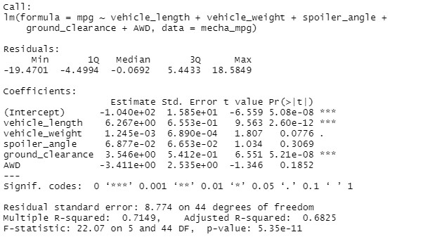
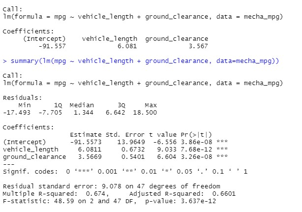
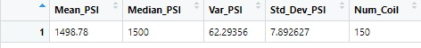
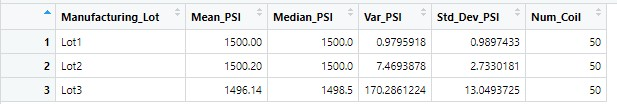
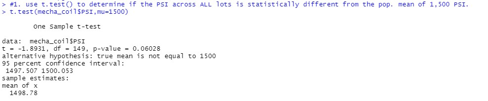
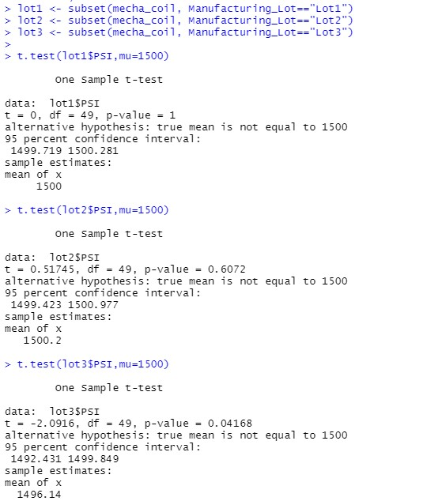

# MechaCar
Perform multiple linear regression analysis, collect summary statistics, run t-tests and write a summary interpretation of the findings utilizing R and R Studio. 

## Deliverable 1
## Linear Regression to Predict MPG
The MechaCar_mpg.csv dataset contains mpg test results for 50 prototype MechaCars. The MechaCar prototypes were produced using multiple design specifications to identify ideal vehicle performance. Multiple metrics, such as vehicle length, vehicle weight, spoiler angle, drivetrain, and ground clearance, were collected for each vehicle. Using your knowledge of R, you’ll design a linear model that predicts the mpg of MechaCar prototypes using several variables from the MechaCar_mpg.csv file.
### Model result 
mpg = (6.267)vehicle_length + (0.0012)vehicle_weight + (0.0688)spoiler_angle + (3.546)ground_clearance + (-3.411)AWD + (-104.0)

Please see data above:
1. The vehicle length, and vehicle ground clearance are statistically likely to provide non-random amounts of variance to the model. The vehicle length and vehicle ground clearance have a significant impact on miles per gallon on the MechaCar prototype. Conversely, the vehicle weight, spoiler angle, and All Wheel Drive (AWD) have p-Values that indicate a random amount of variance with the dataset.

2. The p-Value for this model, p-Value: 5.35e-11, is much smaller than the assumed significance level of 0.05%. This indicates there is sufficient evidence to reject our null hypothesis, which further indicates that the slope of this linear model is not zero.

3. This linear model has an r-squared value of 0.7149, which means that approximately 71% of all mpg predictions will be determined by this model. Relatively speaking, his multiple regression model does predict mpg of MechaCar prototypes effectively.

If we remove the less impactful independent variables (vehicle weight, spoiler angle, and All Wheel Drive), the predictability does slightly decrease: the r-squared value falls from 0.7149 to 0.674.

## Deliverable 2

## Summary Statistics on Suspension

The Suspension Coil dataset provided for the MechaCar contains the results of testing the weight capacities of multiple suspension coils from multiple production lots to determine consistency.

First looking at all manufacturing lots:

Here are the manufacturing lots split into 3 groups:

With the understanding that the design specifications for the MechaCar suspension coils mandate that the variance of the suspension coils cannot exceed 100 pounds per square inch (PSI).

Does the current manufacturing data meet this design specification for all manufacturing lots in total and each lot individually? Why or why not?

When looking at the entire population of the production lot, the variance of the coils is 62.29 PSI, which is well within the 100 PSI variance requirement.

Similarly, but significantly more consistent, Lot 1 and Lot 2 are well within the 100 PSI variance requirement: with variances of 0.98 and 7.47 respectively. However, Lot 3 is showing much larger variance in performance and consistency, with a variance of 170.29.  Lot 3 is causing the variance at the full lot level.

## Deliverable 3

## T-Tests on Suspension Coils
RScript for t-test that compares all manufacturing lots against mean PSI of the population shown below.

RScript for three t-tests that compare each manufacturing lot against mean PSI of the population shown below.

## Deliverable 4
## Study Design: MechaCar vs. Competition
This study would involve collecting data on MechaCar and its comparable models across several different manufacturers over the last 3 years.

What are the comparable models from the competition?
Which cars will MechaCar be competing with head-to-head? which cars will be included in the study?
Which factors will look at the study to determine the relevant to selling price?

### Metrics
Collecting data for comparable models across all major manufacturers for the past few years for the following metrics:

* Safety Feature Rating: Independent Variable
* Current Price (Selling): Dependent Variable
* Drive Package : Independent Variable
* Engine (Electric, Hybrid, Gasoline / Conventional): Independent Variable
* Resale Value: Independent Variable
* Average Annual Cost of ownership (Maintenance): Independent Variable
* MPG (Gasoline Efficiency): Independent Variable

### Hypothesis: Null and Alternative
After determining which factors are key for the MechaCar's genre:

* Null Hypothesis (Ho): MechaCar is priced correctly based on its performance of key factors for its genre.
* Alternative Hypothesis (Ha): MechaCar is NOT priced correctly based on performance of key factors for its genre.

### Statistical Tests
A multiple linear regression would be used to determine the factors that have the highest correlation/predictability with the list selling price (dependent variable); which combination has the greatest impact on price. 
